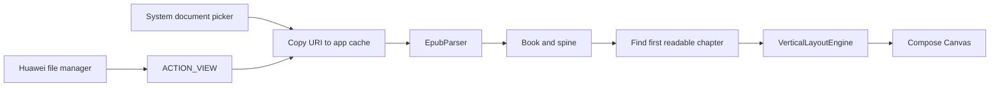
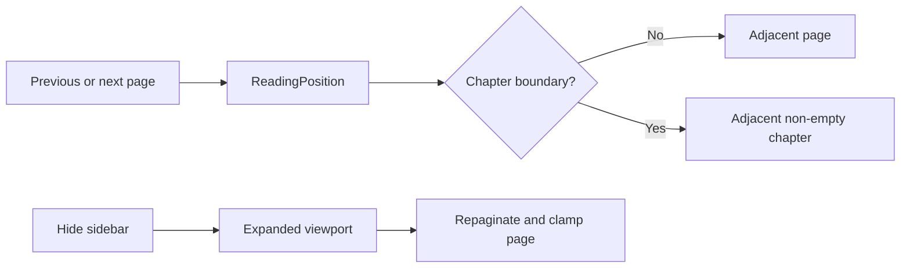
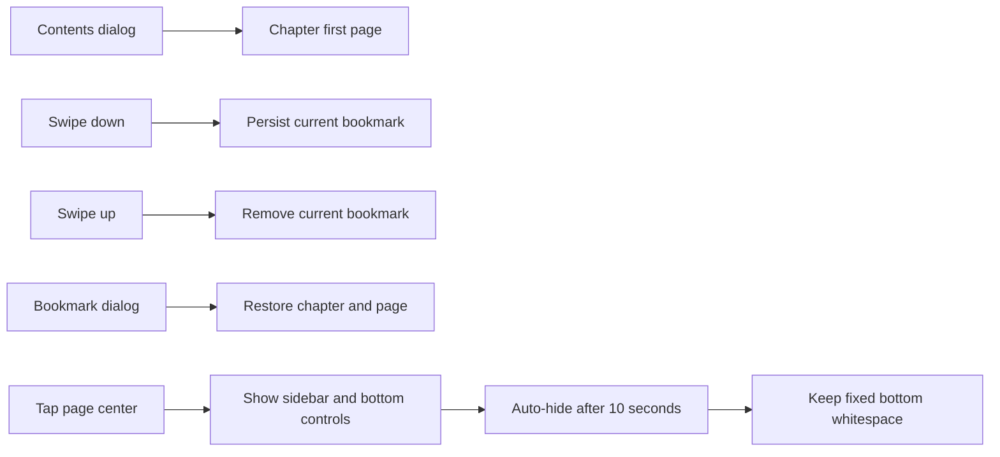
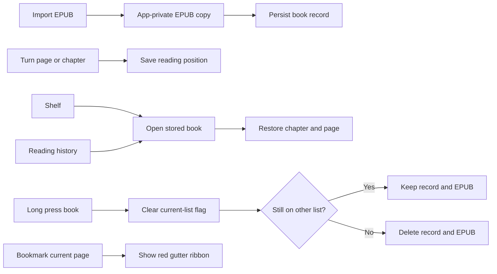
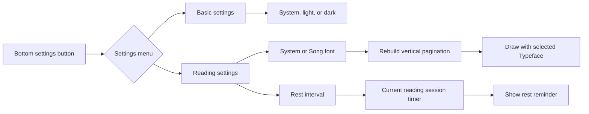
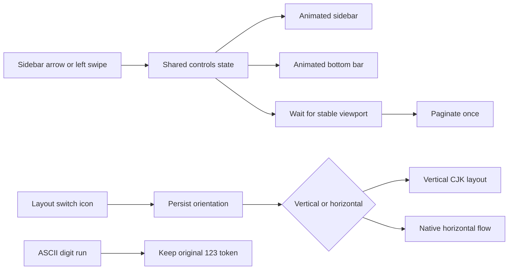
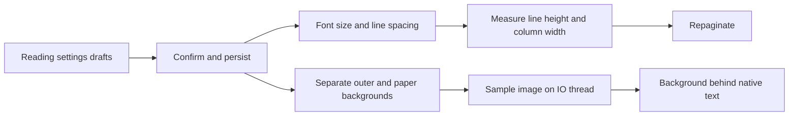

# myReading

Android EPUB reader prototype focused on native vertical CJK layout. The rendering
pipeline is `EPUB -> XML DOM -> CSS -> vertical layout -> Compose Canvas`; it does
not rotate a WebView or rasterize book pages.

## Local EPUB import

**Feature** – Imports local EPUB files through Android's system document picker and
opens the first readable spine chapter. EPUB providers that expose files as EPUB,
ZIP, or generic binary MIME types are accepted. Huawei/HarmonyOS file managers can
also open an EPUB directly with myReading through Android's `ACTION_VIEW` flow.

**Design** – Some EPUB books begin with an SVG-only cover. The current layout engine
does not draw SVG covers, so selecting spine item zero produced an empty page even
though parsing succeeded. Import now keeps the book's original spine order but starts
reading at the first linear chapter containing text. XML security features are
enabled on a best-effort basis because Android and desktop JAXP providers support
different optional feature sets; an entity resolver still blocks external entity
loading on every platform.

**Call Flow**



**Affected Modules** – `MainActivity`, `ReaderViewModel`, `ReadingNavigation`,
`EpubParser`, `XmlSupport`, and `VerticalLayoutEngine`.

## Reader navigation

**Feature** – The chapter information sidebar can be hidden manually and closes
automatically after ten seconds. When hidden, the reading canvas uses the released
width and repaginates. Page progress is shown as `current / total`, and page turns
cross chapter boundaries in both directions.

**Design** – Cross-chapter movement is represented by a testable `ReadingPosition`.
It skips chapters that produce no layout pages and lands on either the first page of
the next chapter or the final page of the previous chapter. Viewport changes clamp
the page index after repagination so hiding the sidebar cannot leave a blank page.

**Call Flow**



**Affected Modules** – `ReaderApp`, `ReaderViewModel`, and `ReadingNavigation`.

## Contents, bookmarks, and book typography

**Feature** – The sidebar opens a complete chapter list and a persistent bookmark
list. Selecting a chapter opens its first page; selecting a bookmark restores its
chapter and page. A downward swipe over the page adds a bookmark and an upward swipe
removes it. Chapter headings use a larger independent vertical column, while each
paragraph starts in a new column with a two-character first-line indent. Tapping the
middle third of the page reveals both controls; they auto-hide after ten seconds.

**Design** – Bookmarks are stored per EPUB identity as chapter/page positions in
Android `SharedPreferences`. The bottom control area always reserves 48dp even when
hidden, preventing page height and pagination from changing as controls appear. The
sidebar may release horizontal space, so viewport changes repaginate and clamp the
active page.

**Call Flow**



**Affected Modules** – `ReaderApp`, `ReaderViewModel`, `ReadingNavigation`, and
`VerticalLayoutEngine`.

## Shelf, history, and reading status

**Feature** – The reader sidebar links to a shelf and reading-history screen. Books
open at their last saved chapter and page, and a long press removes a book from the
current list without affecting the other list. A star toggles shelf membership. The
sidebar footer uses compact chapter/page progress, while the fixed bottom area shows
the system time and current reading-session duration. The reading page reserves a
compact 28dp right gutter and displays a scaled red ribbon there only when the
current page is bookmarked.

**Design** – Imported EPUB files are copied to app-private storage under a stable
SHA-256 identity so document-provider permissions are not required after a restart.
Shelf and history membership are persisted as independent flags alongside the last
reading position. The stored EPUB is deleted only after both flags are cleared. The
right gutter belongs to the page layout rather than overlaying text, keeping the
bookmark ribbon separate from vertical content.

**Call Flow**



**Affected Modules** – `LibraryStore`, `ReaderViewModel`, and `ReaderApp`.

## Reader appearance and rest reminders

**Feature** – Sidebar controls use a content-driven width and consistent single-line
labels. Chapter navigation sits directly above the shelf toggle, and bottom-bar time
labels share one text style. A settings menu opens separate basic and reading
settings: basic settings select system, light, or dark appearance; reading settings
select the system font or Song typeface and configure 15, 30, 45, or 60-minute rest
reminders.

**Design** – Appearance settings are stored independently from each book so they
apply across the library. Theme selection wraps the complete Compose hierarchy and
also supplies explicit paper and ink colors to the custom Canvas renderer. Font
selection participates in the pagination fingerprint and configures the Canvas
`Typeface`, which forces native repagination instead of visually scaling an existing
page. Reminder timing is scoped to the current reading session and repeats from the
time each reminder is issued.

**Call Flow**



**Affected Modules** – `ReaderPreferencesStore`, `ReaderViewModel`, `ReaderApp`, and
`VerticalLayoutEngine` pagination settings.

## Layout mode and transitions

**Feature** – The sidebar can be collapsed with a compact arrow or by swiping it
left. Its width, the bottom bar, and the reading viewport transition together. The
page stays clear while controls open or close. The bottom bar
also provides a persisted vertical/horizontal layout switch. Horizontal mode uses
native horizontal coordinates; it does not rotate the Canvas. Consecutive ASCII
digits remain one readable token, so values such as `123` are not converted into
vertical glyph variants.

**Design** – Sidebar width and alpha animate with the arrow centered on its edge.
The bottom area always reserves 48dp, including when its controls are hidden.
Zero internal bar insets leave room for the two clock labels and 48dp touch targets.
The shelf toggle reuses the bordered sidebar button; chapter and page labels are
centered across the sidebar width. These changes are implemented in `ReaderApp`.
Viewport changes are debounced for 180ms so animation frames do not each parse and
paginate the chapter. Native blur and the duplicate page layer were removed after
device logs reported `RenderEffect` throwing `nativePtr is null`. The layout
engine includes a separate horizontal flow with line wrapping and page breaking,
while the vertical flow keeps CJK punctuation, ruby, and writing-mode behavior
unchanged. The supplied settings and orientation PNGs are downscaled to 192px
thumbnails in `drawable-nodpi` so the original 2048px files are not decoded at
runtime. Both icons use their original colors at 32dp without Material tinting.
CSS font-size parsing checks `rem` before `em` and falls back for malformed units;
this also fixes a separate null-pointer crash found in device logs.

**Call Flow**



**Affected Modules** – `ReaderApp`, `ReaderPreferencesStore`, `LayoutEngine`, and
`LayoutEngineTest`.

## Typography and backgrounds

**Feature** - Headings reserve their actual column width or line height, including
wrapped titles. Horizontal paragraphs start on a new line with a two-character
first-line indent; continuation lines are not indented. The contents dialog adds
spacing between entries and uses a readable multiline line height.

**Design** - Reading settings save font size (12-40), line spacing (1.2-2.5), and
independent outer-page and paper backgrounds. Spacing also scales vertical column
gaps. Changes apply on confirmation, not on every slider movement. Changing size
or spacing repaginates and returns to the current chapter's first page; background
changes preserve position. Five light solid colors are available, defaulting to
warm beige. Each background can alternatively use a local image selected through
the document picker with persisted read permission. Images decode off the UI thread
with a maximum sampled dimension of 2048px and a readability overlay; unreadable
images fall back to the selected color. Night mode darkens both layers.

**Call Flow**



**Affected Modules** - `LayoutEngine`, `ReadingAppearance`, `ReaderPreferencesStore`,
`ReaderApp`, `ReadingBackground`, and layout regression tests.

## Build

Use JDK 17 and the included Gradle wrapper:

```shell
./gradlew testDebugUnitTest
./gradlew assembleDebug
```
