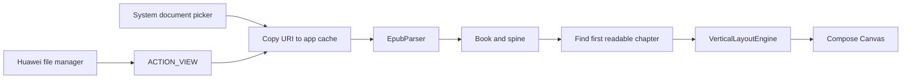

# myReading

Android EPUB reader prototype focused on native vertical CJK layout. The rendering
pipeline is `EPUB -> XML DOM -> CSS -> vertical layout -> Compose Canvas`; it does
not rotate a WebView or rasterize book pages.

## Local EPUB import

**Feature** – Imports local EPUB files through Android's system document picker and
opens the first readable spine chapter. EPUB providers that expose files as EPUB,
ZIP, or generic binary MIME types are accepted. Huawei/HarmonyOS file managers can
also open an EPUB directly with myReading through Android's `ACTION_VIEW` flow.

**Design** – Some EPUB books begin with an SVG-only cover. The current layout engine
does not draw SVG covers, so selecting spine item zero produced an empty page even
though parsing succeeded. Import now keeps the book's original spine order but starts
reading at the first linear chapter containing text.

**Call Flow**



**Affected Modules** – `MainActivity`, `ReaderViewModel`, `ReadingNavigation`,
`EpubParser`, and `VerticalLayoutEngine`.

## Build

Use JDK 17 and the included Gradle wrapper:

```shell
./gradlew testDebugUnitTest
./gradlew assembleDebug
```
