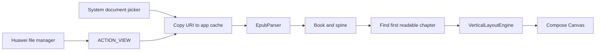
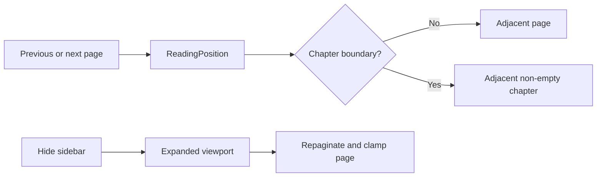

# myReading

Android EPUB reader prototype focused on native vertical CJK layout. The rendering
pipeline is `EPUB -> XML DOM -> CSS -> vertical layout -> Compose Canvas`; it does
not rotate a WebView or rasterize book pages.

## Local EPUB import

**Feature** – Imports local EPUB files through Android's system document picker and
opens the first readable spine chapter. EPUB providers that expose files as EPUB,
ZIP, or generic binary MIME types are accepted. Huawei/HarmonyOS file managers can
also open an EPUB directly with myReading through Android's `ACTION_VIEW` flow.

**Design** – Some EPUB books begin with an SVG-only cover. The current layout engine
does not draw SVG covers, so selecting spine item zero produced an empty page even
though parsing succeeded. Import now keeps the book's original spine order but starts
reading at the first linear chapter containing text. XML security features are
enabled on a best-effort basis because Android and desktop JAXP providers support
different optional feature sets; an entity resolver still blocks external entity
loading on every platform.

**Call Flow**



**Affected Modules** – `MainActivity`, `ReaderViewModel`, `ReadingNavigation`,
`EpubParser`, `XmlSupport`, and `VerticalLayoutEngine`.

## Reader navigation

**Feature** – The chapter information sidebar can be hidden manually and closes
automatically after ten seconds. When hidden, the reading canvas uses the released
width and repaginates. Page progress is shown as `current / total`, and page turns
cross chapter boundaries in both directions.

**Design** – Cross-chapter movement is represented by a testable `ReadingPosition`.
It skips chapters that produce no layout pages and lands on either the first page of
the next chapter or the final page of the previous chapter. Viewport changes clamp
the page index after repagination so hiding the sidebar cannot leave a blank page.

**Call Flow**



**Affected Modules** – `ReaderApp`, `ReaderViewModel`, and `ReadingNavigation`.

## Build

Use JDK 17 and the included Gradle wrapper:

```shell
./gradlew testDebugUnitTest
./gradlew assembleDebug
```
